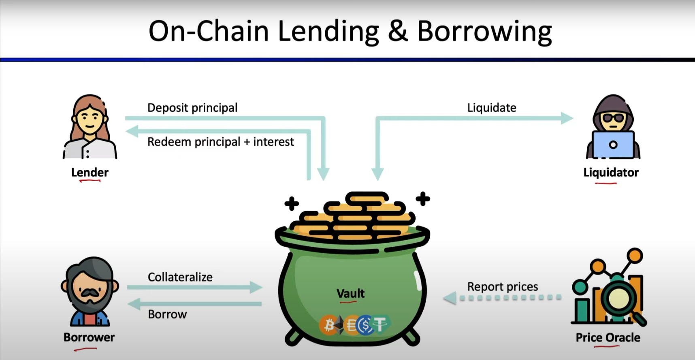

# Lending

## Actors in this process

### Vault

A smart contract that manages the financial assets among these different entities

### Lender

Typically needs to deposit capital, that others can borrow, and receives an interest rate for this

### Borrower

After giving a certain collateral X amount, the borrower can then ask for a loan of X-Y%, where Y is defined in the lending contract agreements. The only risk to this is the borrower might get liquidated.

For example: Giving 100ETH in some protocols will allow you to get a loan of 50ETH

### Liquidator

If the value of the collateral given by the borrower drops below a certain value, then the price oracles update the on-chain prices of the collateral assets.\
After this liquidators are incentivized to issue a liquidation request to do votes on this liquidation event, the liquidators are incentivized to do so because they receive a discount to buy this collateral.

## Liquidation

In traditional finance, liquidation occurs when a company or group must sell some of its assets at a loss to cover a debt. DeFi liquidations are similar in that users take out debt from a protocol and provide crypto assets as collateral to back the debt. Thus, DeFi liquidation is the process by which a smart contract sells crypto assets to cover the debt.

_Reference:_ [_https://medium.com/coinmonks/what-is-liquidation-in-defi-lending-and-borrowing-platforms-3326e0ba8d0#:\~:text=What%20does%20liquidation%20mean%20in,collateral%20to%20back%20the%20debt._](https://medium.com/coinmonks/what-is-liquidation-in-defi-lending-and-borrowing-platforms-3326e0ba8d0#:\~:text=What%20does%20liquidation%20mean%20in,collateral%20to%20back%20the%20debt.)__

## Over-Collateralized Borrowing

.png>)

The provision of collateral that is worth more than enough to cover potential losses in cases of default. It is used to effectively manage risk and involves placing an asset as collateral on a loan where the value of the asset exceeds the value of the loan.

An over-collateralized **stablecoins** has a large number of cryptocurrency tokens maintained as a reserve for issuing a lower number of **stablecoins**. This offers a buffer against price fluctuations.

[**DAI**](https://coinmarketcap.com/currencies/multi-collateral-dai/)**, for example, has a loan and repayment process utilizing a collateralized debt position via MakerDAO to secure assets as collateral on-chain**. Users can deposit Ether or other accepted cryptocurrencies and can borrow against the value of their deposits to receive newly generated DAI.&#x20;

_reference:_ [_https://coinmarketcap.com/alexandria/glossary/over-collateralization_](https://coinmarketcap.com/alexandria/glossary/over-collateralization)__

.png>)

## Under-Collateralized Borrowing

an undercollateralized loan is any loan that is not fully collateralized. That is to say that if the loan were defaulted, the collateral would not fully cover the principal.

#### Types of Undercollateralized Loans

From the start, we should mention that DeFi has produced several types of undercollateralized loans. Each of them comes with different features. However, all abide by the same principle, enabling borrowers access to funds with minimum collateral.

At the moment, we can divide undercollateralized loans into eight kinds:

1. **Flash Loans**
2. Third-party Risk Assessment
3. Crypto Native Credit Scores
4. Off-chain Credit Integration
5. Personal Network Bootstrap
6. Real-world Asset Loans
7. NFTs as Collateral
8. Digital Asset Loans

## Flash Loans

