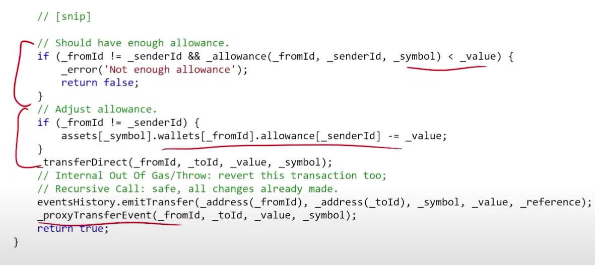

# Lending

## Actors in this process

### Vault

A smart contract that manages the financial assets among these different entities

### Lender

Typically needs to deposit capital, that others can borrow, and receives an interest rate for this

### Borrower

After giving a certain collateral X amount, the borrower can then ask for a loan of X-Y%, where Y is defined in the lending contract agreements. The only risk to this is the borrower might get liquidated.

For example: Giving 100ETH in some protocols will allow you to get a loan of 50ETH

### Liquidator

If the value of the collateral given by the borrower drops below a certain value, then the price oracles update the on-chain prices of the collateral assets.\
After this liquidators are incentivized to issue a liquidation request to do votes on this liquidation event, the liquidators are incentivized to do so because they receive a discount to buy this collateral.

## Over-Collateralized Borrowing

