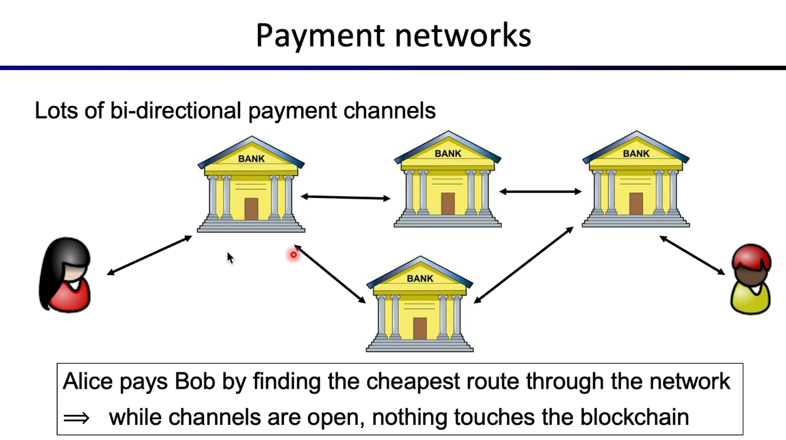

# (1) Scaling Bitcoin using Payment Channels

**Example to help us understand:**

\-> Alice creates a payment channel to Bob, through UTXO or Smart-Contract, depositing 100 $ in this escrow channel;

* This involves a Hashed Time Lock Contract logic, so there's two ways to close this channel:
  * Tx with Alice signature: can close channel after 30 days, or
  * Tx with Alice & Bob signature: close channel right away;

\-> Alice with her deposited 100$ can then pay Bob 5$, and then Bob can sign a Tx and close this channel getting the 5$ for himself, within the 30 days lock time period. And Alice gets the remaining 95$ in the channel.

\-> To close this channel, Bob needs to sign the latest Alice's Tx on the channel, which says Alice gets 95$ and Bob gets 5$ of the 100$ in the channel. However Alice can only close after the lock up time period.

Alice while the channel is open, can make multiple Tx's to Bob without ever touching the blockchain, as the only thing that touched the blockchain was the creation of this channel and the closing of the channel.&#x20;

This channel can be bi-directional and no more than the deposited funds can be transacted.

### Lightning Network

Lots of bi-directional payment channels are created as nodes, that enable the payment from Alice to Bob, replicating a traditional payment network as in banks. Alice, to pay Bob, would then choose the route with less payment fees through this network.

As long as all these routing channels are open, Alice creates a channel between her "bank" and then Bob with his "bank", and both can transact assets within the Lighting Network.

