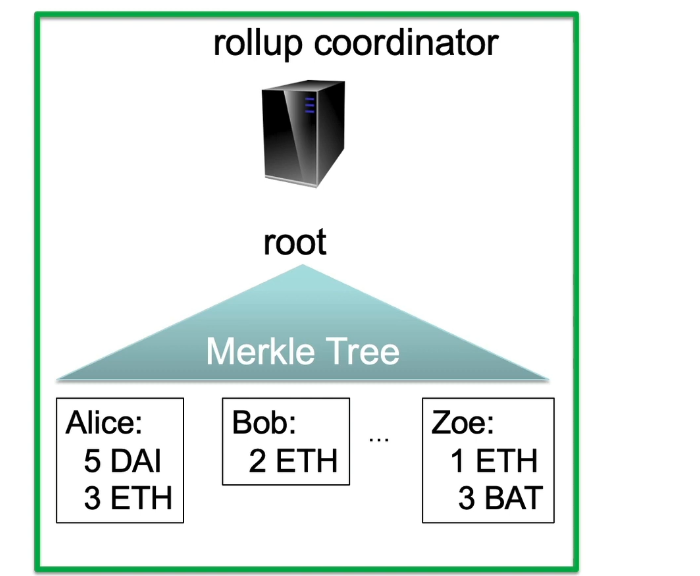

# (2) Scaling Ethereum using Rollup

### SNARKs ( Succinct non-interactive argument of knowledge )

Allows one party, which we call approver, to prove to a verifier that a certain statement is true.

This program always terminates in a fixed number of steps. Takes a public input and a private input.

Produces a short proof that it knows that a valid witness such as that the output of the program is true, and easily verifiable by a blockchain miner with less complexity than our SNARK program.

\-> Alice and a group sends transactions to a Rollup coordinator, who then verifies all the transactions, meaning there are enough funds in the accounts, the transactions were properly signed, etc...

\-> The coordinator will then output a short proof that all these Tx's are valid, and then will send this proof over to the miners, along with a short Tx summary.

This helps scaling the blockchain, as the miners will only have to verify this single proof to validate all those Tx's.

