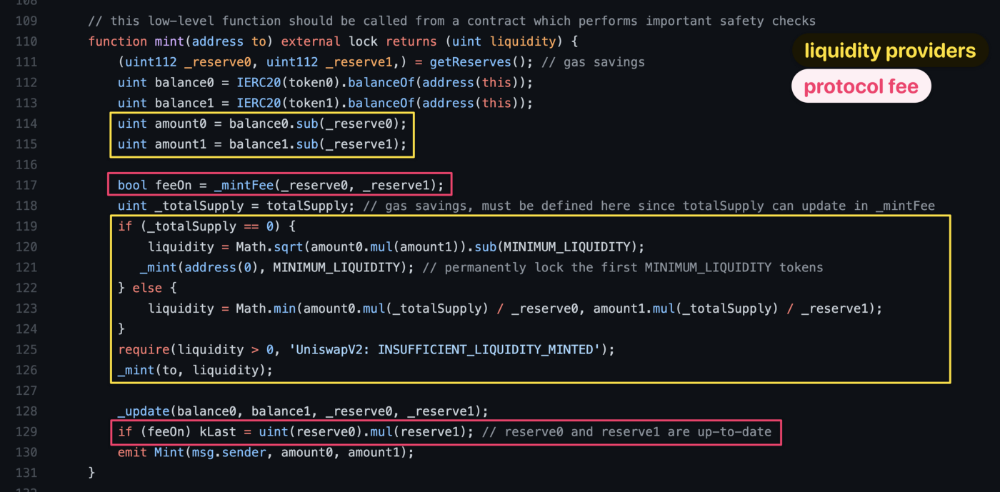

# Solidity and Ethereum Bytecode

## Solidity

is statically typed like Java, C, Rust... unlike Python or Javascript. Meaning you have to declare variables types before using the variable.

Specially for integers, you need to specify if it's signed or unsigned integer, and the bytes of said integer.

### Mapping data types

\-> Mapping: a key value storage / hash table;

\-> Every key is initially mapped to zero;

\-> There is no built-in way to query the length of a mapping, or iterate over its non-zero elements. A separate variable can be used;

### Function signatures

 (1).png>)

### Constructors

\-> Invoked when initially creating the contract

\-> Used to customized settings or give an initial state

.png>)

### Visibility Modifiers

.png>)

### Mutability Modifiers

.png>)

### Events

\-> A way to subscribe to an event of a contract, and a good way to print/debug your code.

\-> Any node that is subscribed to this event is going to get notified the parameters of the events.

### Calling methods of other contracts

\-> First define the interface for an external contract: .png>)

\-> Next you need to have the address of said external contract, only then you can invoke the functions of the external contract:  (1).png>)

### Working with the native currency

The payable modifier, any send method to a function without this modifier will reject the sent Ether, if they are marked as payable then they can accept Ether.

.png>)

### Reading the current time

.png>)

### Data Locations - Storage, Memory and Calldata

Variables are declared as either `storage`, `memory` or `calldata` to explicitly specify the location of the data.

* `storage` - variable is a state variable (store on blockchain)
* `memory` - variable is in memory and it exists while a function is being called
* `calldata` - special data location that contains function arguments, only available for `external` functions

### Inheritance

Inheritance is a way to extend functionality of a contract. Solidity supports both single as well as multiple inheritance. Following are the key highlights.

* A derived contract can access all non-private members including internal methods and state variables. But using this is not allowed.
* Function overriding is allowed provided function signature remains same. In case of difference of output parameters, compilation will fail.
* We can call a super contract's function using super keyword or using super contract name.
* In case of multiple inheritance, function call using super gives preference to most derived contract.

### Abstract Contracts 

Contracts need to be marked as `abstract` when at least one of their functions isn’t implemented. Contracts may be marked as `abstract` even though all functions are implemented.

This can be done using the `abstract` keyword for the contract, and functions that aren’t implemented should have the `virtual` keyword to allow polymorphism.

### Interfaces 

Interfaces are similar to abstract contracts, but they can’t have any functions implemented. There are further restrictions:

* They can’t inherit from other contracts, but they can inherit from other interfaces
* All declared functions must be external
* They can’t declare a constructor
* They can’t declare state variables

Interfaces are declared using the `interface` keyword.

