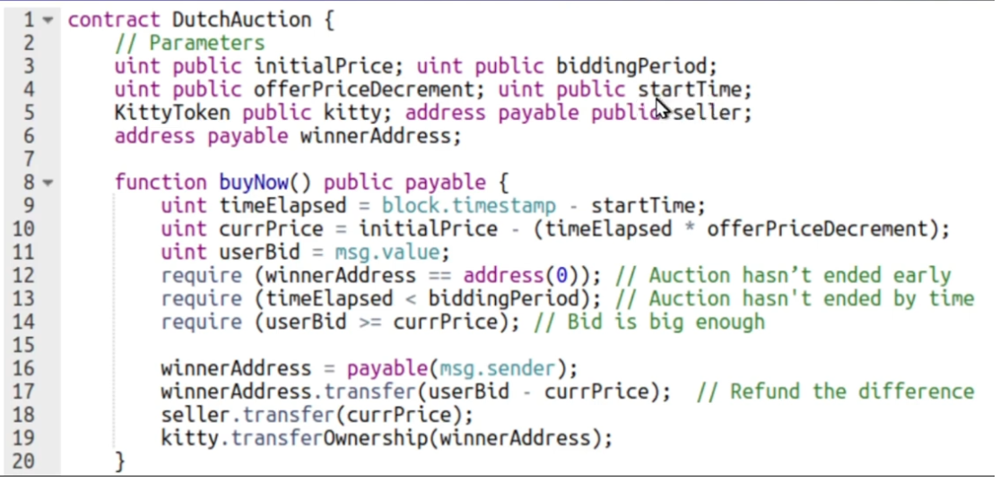

# Case Study: Dutch auction as Smart Contract

A Dutch auction is an auction for something where the more time passes, the less value the initial bid for a sale will be. And buyers can choose to buy the asset whenever they want, and the asset will be removed from the auction as soon as there is a buyer for it.

